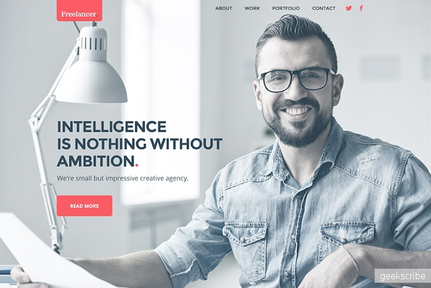

# Шаблон для сайта портфолио

Макет шаблона в формате .psd взят [отсюда](https://psd.in.ua/svetlyj-maket-sajta-dlya-portfolio/)

[Демонстрация верстки](https://heknt90.github.io/layout-portfolio-landing/)

## При верстке данного макета, использовалась система сборки gulp

### Для установки всех зависимостей

    npm i

Убедитесь, что на вашем компьютере установлен npm

### Для запуска сборщика

    npm run dev

### Используемые средства

    - gulp
    - font awesome
